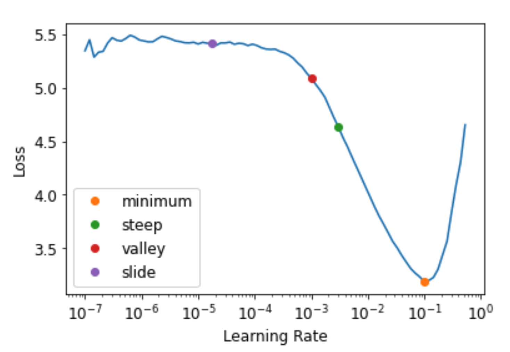

# Image Classification

import TOCInline from '@theme/TOCInline';

<TOCInline toc={toc} />


## Data Prep

Remember, `Datablock` helps create `DataLoaders`.  

```python
from fastai.vision.all import *
path = untar_data(URLs.PETS)

pets = DataBlock(blocks = (ImageBlock, CategoryBlock),
                 get_items=get_image_files, 
                 splitter=RandomSplitter(seed=42),
                 get_y=using_attr(RegexLabeller(r'(.+)_\d+.jpg$'), 'name'),
                 item_tfms=Resize(460),
                 batch_tfms=aug_transforms(size=224, min_scale=0.75))
```

### Debugging

You can debug the Datablock by calling .summary(), which will show you if you have any errors.

```python
pets.summary(path/"images")
```

If everything looks good, you can use the DataBlock to create a `DataLoaders` instance:

```python
dls = pets.dataloaders(path/"images")
```

Once you have a `DataLoaders` instance, it is a good idea to call `show_batch` to spot check that things look reasonable:

You can debug this by using `show_batch`:

```python
>>> dls.show_batch(nrows=1, ncols=3)
... [shows images]
```

Finally, you can see what a batch looks like by calling `dls.one_batch()`

```python
x,y = dls.one_batch()
```

You always want to train a model ASAP as your final debugging step.  If you wait too long, you will not discover problems

```python
learn = cnn_learner(dls, resnet34, metrics=error_rate)
learn.fine_tune(2)
```

### Example of an error in data prep

A common error is forgetting to use `Resize` in your DataBlock as an item transform.  For example, the below code will cause an error:

```python
pets1 = DataBlock(blocks = (ImageBlock, CategoryBlock),
                 get_items=get_image_files, 
                 splitter=RandomSplitter(seed=42),
                 #forgot to pass `item_tfms=Resize(...),`
                 get_y=using_attr(RegexLabeller(r'(.+)_\d+.jpg$'), 'name'))
pets1.summary(path/"images")
```

This will complain that it is not able to collate the images because they are of different sizes.

## Interpretation

You can get diagnostics for your model using this:

```python
interp = ClassificationInterpretation.from_learner(learn)
interp.plot_confusion_matrix(figsize=(12,12), dpi=60)
```
Which will return a confusion matrix.  You can see the "most confused" items by doing this:

```python
>>> interp.most_confused(min_val=5)
[('Bengal', 'Egyptian_Mau', 10),
 ('american_pit_bull_terrier', 'staffordshire_bull_terrier', 8),
 ('Ragdoll', 'Birman', 7),
 ('staffordshire_bull_terrier', 'american_pit_bull_terrier', 6),
 ('american_pit_bull_terrier', 'american_bulldog', 5)]
```

## Improving the model

### Learning Rate Finder

Start with a very, very small learning rate, something so small that we would never expect it to be too big to handle. We use that for one mini-batch, find what the losses are afterwards, and then increase the learning rate by some percentage (e.g., doubling it each time). Then we do another mini-batch, track the loss, and double the learning rate again. We keep doing this until the loss gets worse, instead of better. This is the point where we know we have gone too far. We then select a learning rate a bit lower than this point. Our advice is to pick either:

- One order of magnitude less than where the minimum loss was achieved (i.e., the minimum divided by 10)
- The last point where the loss was clearly decreasing 

The learning rate finder computes those points and more on the curve to help you. Additional learning rate suggestion algorithms can be passed into the function, by default only the valley paradigm is used. The learning rate finder can be called with `learn.lr_find`:

```python
>>> learn = cnn_learner(dls, resnet34, metrics=error_rate)
>>> lr_min, lr_steep, lr_valley, lr_slide = learn.lr_find(suggest_funcs=(minimum, steep, valley, slide))
```



The default `valley` hueristic works just fine.  Note, you will want to re-run this anytime you change your model such as unfreeze layers.  You might want to run this periodically if you are checkpointing during training.

### Fine Tuning models

When we create a model from a pretrained network fastai automatically freezes all of the pretrained layers for us. When we call the `fine_tune` method fastai does two things:

- Trains the randomly added layers for one epoch, with all other layers frozen
- Unfreezes all of the layers, and trains them all for the number of epochs requested

Although this is a reasonable default approach, it is likely that for your particular dataset you may get better results by doing things slightly differently. The `fine_tune` method has a number of parameters you can use to change its behavior, but it might be easiest for you to just call the underlying methods directly if you want to get some custom behavior.

`fit_one_cycle` is the suggested way to train models without using `fine_tune`. We'll see why later in the book; in short, what `fit_one_cycle` does is to start training at a low learning rate, gradually increase it for the first section of training, and then gradually decrease it again for the last section of training.

```python
learn = cnn_learner(dls, resnet34, metrics=error_rate)
learn.fit_one_cycle(3, 3e-3) # train the head
learn.unfreeze() # unfreeze everything
learn.lr_find() # find new lr after unfreezing
learn.fit_one_cycle(6, lr_max=1e-5) #fine tune it all
```

### Discriminative Learning Rates

One important aspect of fine tuning is discriminative learning rates: use a lower learning rate for the early layers of the neural network, and a higher learning rate for the later layers (and especially the randomly added layers).

fastai lets you pass a Python `slice` object anywhere that a learning rate is expected. The first value passed will be the learning rate in the earliest layer of the neural network, and the second value will be the learning rate in the final layer. The layers in between will have learning rates that are multiplicatively equidistant throughout that range. Let's use this approach to replicate the previous training, but this time we'll only set the *lowest* layer of our net to a learning rate of 1e-6; the other layers will scale up to 1e-4. Let's train for a while and see what happens:

```python
learn = cnn_learner(dls, resnet34, metrics=error_rate)
learn.fit_one_cycle(3, 3e-3)
learn.unfreeze()
learn.fit_one_cycle(12, lr_max=slice(1e-6,1e-4))
```

We can accomplish everything we did above by calling `fine_tune` instead.  `fine_tune` will automatically apply discriminative learning rates for you:

```python
>>> learn.fine_tune??
Signature:
learn.fine_tune(
    epochs,
    base_lr=0.002,
    freeze_epochs=1,
    lr_mult=100,
    pct_start=0.3,
    div=5.0,
    lr_max=None,
    div_final=100000.0,
    wd=None,
    moms=None,
    cbs=None,
    reset_opt=False,
)
Source:   
@patch
@delegates(Learner.fit_one_cycle)
def fine_tune(self:Learner, epochs, base_lr=2e-3, freeze_epochs=1, lr_mult=100,
              pct_start=0.3, div=5.0, **kwargs):
    "Fine tune with `Learner.freeze` for `freeze_epochs`, then with `Learner.unfreeze` for `epochs`, using discriminative LR."
    self.freeze()
    self.fit_one_cycle(freeze_epochs, slice(base_lr), pct_start=0.99, **kwargs)
    base_lr /= 2
    self.unfreeze()
    self.fit_one_cycle(epochs, slice(base_lr/lr_mult, base_lr), pct_start=pct_start, div=div, **kwargs)
File:      ~/anaconda3/lib/python3.9/site-packages/fastai/callback/schedule.py
Type:      method
```

## Mixed Precision Training

You can achieve mixed precision training to speed up training and give you more memory headroom for bigger models with `to_fp16()`

```python
from fastai.callback.fp16 import *
learn = cnn_learner(dls, resnet50, metrics=error_rate).to_fp16()
learn.fine_tune(6, freeze_epochs=3)
```

Note how you can use the `freeze_epochs` parameter to keep the base frozen for longer.
