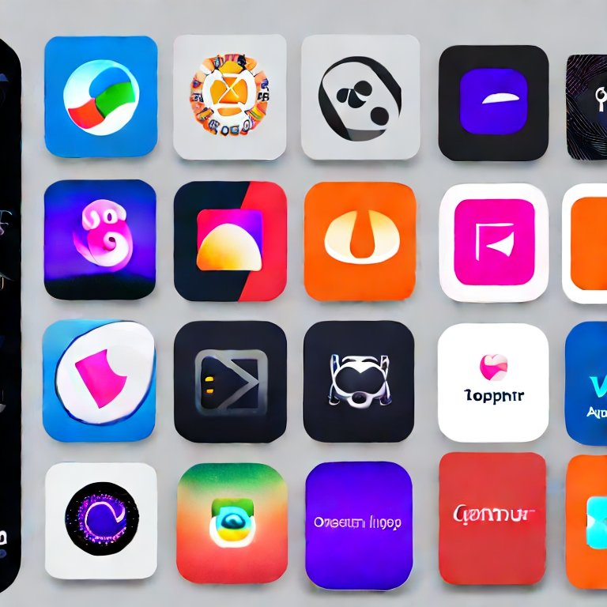
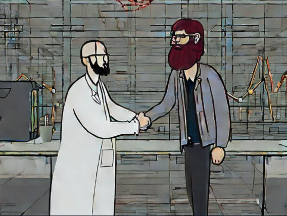
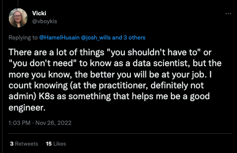

I agree with [Chip Huyen](https://huyenchip.com/2021/09/13/data-science-infrastructure.html) that Data Scientists **shouldn't need to** learn kubernetes (K8s).   However, the cold truth is:  **Even though you shouldn't have to, you should!**  I was convinced for the longest time that I had no business with K8s, but I have recently turned the corner.

Below, I oultline some reasons why:

# Nobody Is Coming To Save You

A common first experience as a data scientist or machine learning professional is that you don't have to the tools you need to get started.  This is incredibly frustrating, as it can be hard to make any progress without the proper tools.  This usually culminates in a conversation like this (DS = data scientist):

---

DS: I'm really excited to join ACME company!  You've hired me to optimize marketing spend with predictive models.  The issue is that we don't have basic infrastructure or tools are necessary for me to work efficiently. 

Manager: I'm confused, can't you install the tools you need?  Isn't that what you are for?  I was expecting that you would figure it out. 

DS:  No, I don't know how to setup and deploy infrastructure.  We need a special infrastrucuture or DevOps person for that.

Manager: It will be hard to ask for more resources if we don't know the expected return on investment.  Can you do the ML project first, demonstrate some value, and then we can invest in infrastrucutre? 

DS:  I need some minimum tools to allow me to more quickly experiment and development proof of concepts.  Also I need tools that might help me collaborate better with my team...

---

_At this point the Manager and DS are stuck debating the chicken and the egg problem.  This is an unpleasant impasse that leads to career dissatisfaction and stagnation. _

By learning some basic infra skills, you can unblock yourself and your team in many cases!

# Helm Charts Are the Modern OSS App Store

This is perhaps the most compelling reason for learning K8s.  So you can quickly install your favorite data science tools in the cloud.

[Helm](https://helm.sh/)is a package mansger for K8s.   It allow you to quickly install a wide variety of software in the cloud.  Sure, you can install software on your laptop with pip install, **but the whole point of many data science tools to allow you to work collaboratively with your team**.  To properly evaluate these tools, you will want to install them in an environment that your whole team can observe and interact with.   

Many data science tools can be installed with Helm:  

- Airflow: https://airflow.apache.org/docs/helm-chart/stable/index.html
- Dask: https://docs.dask.org/en/stable/deploying-kubernetes-helm.html
- JuptyerHub: https://z2jh.jupyter.org/en/stable/jupyterhub/installation.html
- Metaflow: https://github.com/outerbounds/metaflow-tools#metaflow-services-on-kubernetes-k8s
- Prefect: https://github.com/PrefectHQ/prefect-helm
- ElasaticSearch: https://github.com/elastic/helm-charts

You don't need to become an expert to deploy  in K8s to deploy these apps.  You might need deeper exerptise to maintain them over a long period of time, however being dangerous enough to deploy these tools will often allow you to get over the initial hump to show enough value to get help!  Even when you do get help, its helpful to know how to perform basic troubleshooting.

# ML Research is Crowded.  Compete on SWE Skills.

One of the best ways to set yourself apart as a data scientist are your skills.  Traditional DS education emphasizes learning the latest ML techniques.  Furthermore, the most successfull ML researchers enjoy visibility and high compensation.  However, Cutting-edge ML research is very competitive.  It also moves incredibly fast!  In the last 6 months, we have seen Stable Diffusion and ChatGPT, with more to come.  It's also an extremely crowded space.

In my experience, the bottleneck many teams face is not lack of knowledge of cutting edge ML techniques, but software engineering skills and partners to help operationalize your models.  If you take some time to learn how to stand up some tools and infrastructure, you will be invaluable to your team.  Knowing some cross functional skills like this is much less crowded compared to ML research, and also more stable over time.  

# You don't need to become an expert

K8s are complicated, but you don't need to become an expert.  I would focus on three  capabilities:

1. Deploying tools / infra you need (with the help of managed cloud services)
2. Basic debugging 
3. Familiarity with high level important concepts

I'm not suggesting that data scientists become K8s adminstrators.  That is a very involved task and worthy of it's own role.  We can use managed cloud services and some basic knowledge to get really far.  

# Your Company Likely Already Runs K8s

I believe that data scientists should have tools that meet them where they are.  This means allowing them to use tools that best suit their workflow, rather than adopt another disciplines workflow.  An example of an anti-pattern of not meeting data scientists where they are is not allowing development in Jupyter Notebooks.  

By deploying and exploring tools in K8s you increase the liklihood that:

- Your devops counterparts will feel comfortable with the tools you want to deploy
- You will have shared language in which to talk your application adminstrators about
- You will be more likely to attract people to help you with infra
- You will look smart for leveraging technology that's already adopted, even if its not perfect.  

These factors make it much more likely that you will get the tools that meet you where you are as opposed to something a software engineer without any data science experience thinks is a good idea (which I've seen happen a lot!)

_Even if your company doesn't run K8s, you easily recruit generalists that can operate K8s for you, as opposed to trying to find a unicorn that specializes in ML Infrastructure._

# Vicki Said So

[Vicki](https://vickiboykis.com/) is the champion of data scientists on the ground.  Her views resonate with people in industry, especially those outside Silicon Valley about the realities of being a data scientist.  She is not someone who is impressed by flashy or new technologies, and is someone who takes a pragmatic approach to getting the job done.  

When she says you should learn K8s, you should really pay attention:

https://twitter.com/vboykis/status/1596611044209983488

# Isn't it Overkill?

For simple apps that you want to quickly stand up or prototype, K8s could be overkill.  I'm advocating knowledge of K8s as something that is useful when you are working within a large company.  

If you are looking to stand up a production service, it is often going to be insufficient to host your data product on a single VM.  In fact, many companies have infrastrucutre that may block you from doing this, and paved paths might only include kuberenetes. 