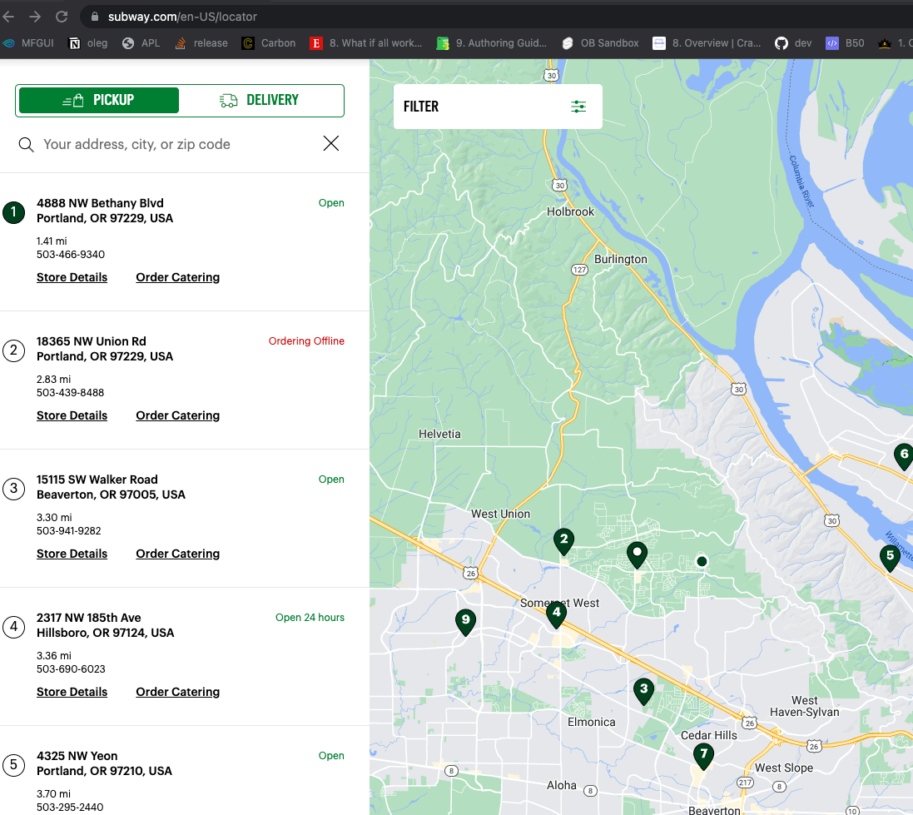
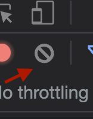
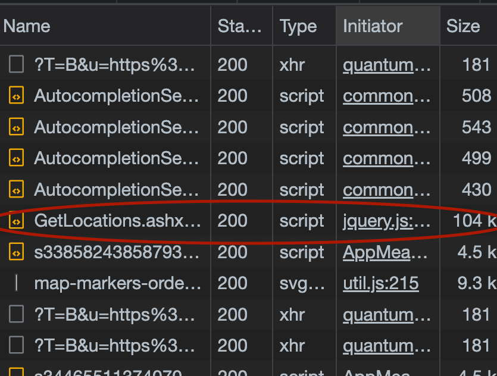
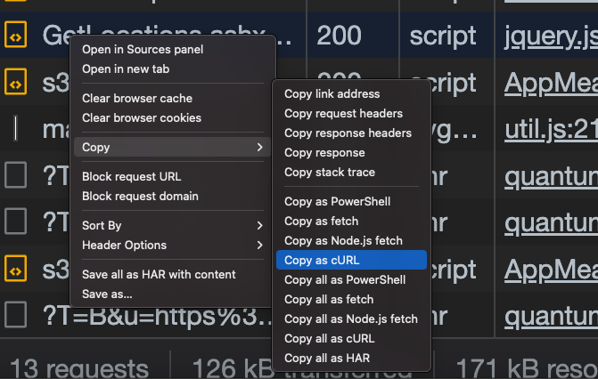
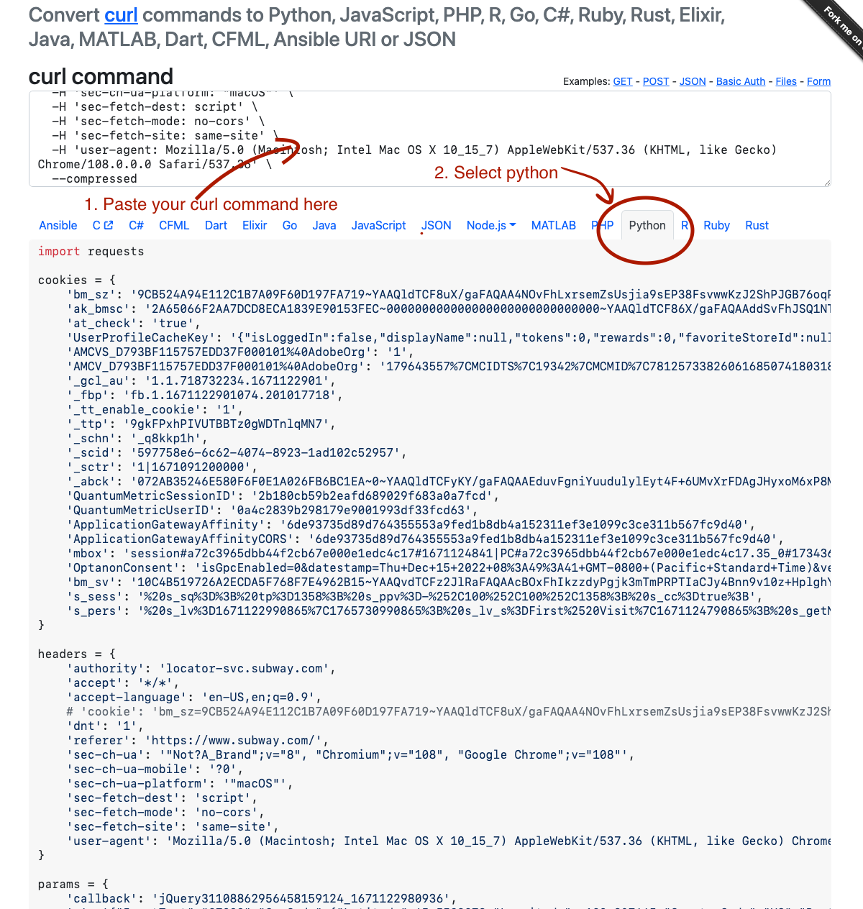

I learned this from Zachary Blackwood's 2022 [NormConf](https://normconf.com/) Talk.

## Example: Get A List of Subway Restaurants With Python

1. Go to https://www.subway.com/en-US/locator in Google Chrome

2. Open developer tools using `Option + CMD + I`

3. Go the the network tab, and hit the clear button

4. Look for a network request that seems like it is getting data, in this case `GetLocations.ashx...` looks super promising.

5. Right click on that particular event and select `Copy -> Copy as Curl`

6. Go to [curlconverter.com](https://curlconverter.com/) and paste the curl command there.

Enjoy your python code that uses this otherwise undocumented API :)